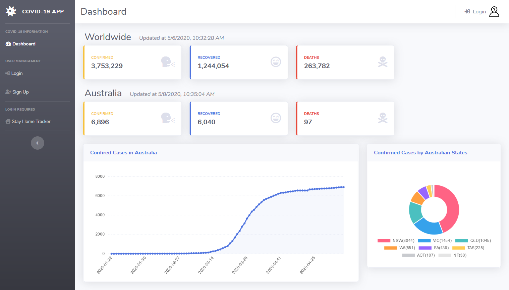
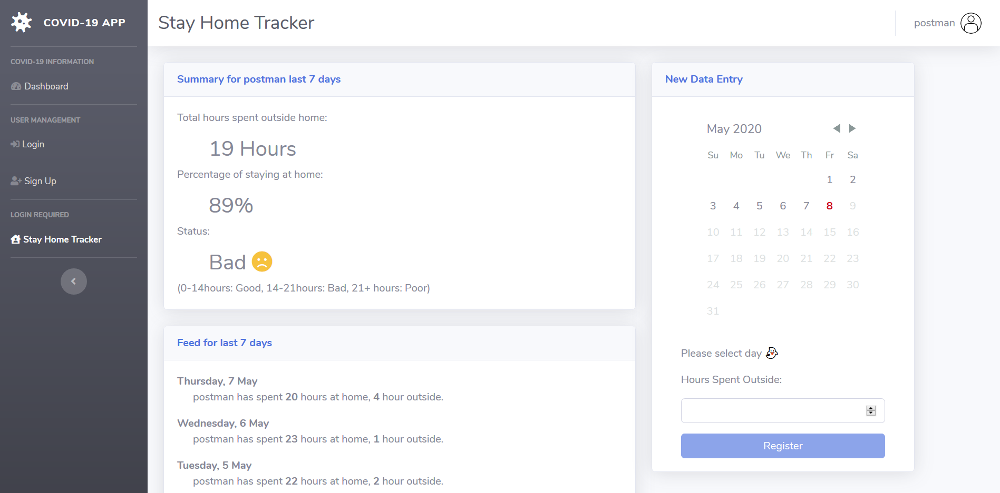

# Covid-19 Dashboard and Stay Home Tracker 

Since the outbreak of the coronavirus, we have been told to stay home to "flatten the curve". The aim of my app is to present the statistics in a graph format. This dashboard shows the number of cases in Australia state by state. 

In addition, I have created the Stay Home Tracker to motivate people to stay home. It records the number of hours spent outside of home. 

## Live demo :earth_asia:
This application has been deployed to Heroku. 

https://covid19-au.herokuapp.com/

The react front-end has also been deployed to [Netlify](https://www.netlify.com/) for faster access. The same app can also be accessed from here. 

https://covid19-au.netlify.app/

## Screen Captures

Dashboard 

Stay Home Tracker (Login using a demo user or sign up. Demo User: corona, Password: 123)

## Technologies  	
* [React](https://reactjs.org/) (Hooks, Context API), [Bootstrap](https://getbootstrap.com/), [chart.js](https://www.chartjs.org/), [react-chartjs-2](https://github.com/jerairrest/react-chartjs-2), [react-day-picker](http://react-day-picker.js.org/), [react-table](https://github.com/tannerlinsley/react-table), LocalStorage
* [Node.js](https://nodejs.org/), [Express](https://expressjs.com/), [MongoDB](https://www.mongodb.com/), [mongoose.js](https://mongoosejs.com/), [Passport](http://www.passportjs.org/), [axios](https://www.npmjs.com/package/axios), [bcrypt](https://www.npmjs.com/package/bcrypt)

## Deployment to Netlify  
As heroku server may get very slow on 'free' plan, I have deployed React front-end to [Netlify](https://www.netlify.com/). The same App on Netlify uses back-end API and MongoDB which are hosted on heroku. 

## Credit 
### COVID-19 Data Source
* [about-corona.net](https://about-corona.net/) 
* Australian states data by [ArcGIS](https://www.arcgis.com/home/item.html?id=35b077523be94f7288b21db815e6e6e6)

### HTML, CSS, Bootstrap 
* [Startbootstrap](https://startbootstrap.com/)

### MERN Passport App Tutorial 
* Article on [medium](https://medium.com/@brendt_bly/simple-mern-passport-app-tutorial-4aec2105e367)
* Source code on [github](https://github.com/b-bly/simple-mern-passport)

### Graphics
* Covid19 icons by [fontawesome.com](https://fontawesome.com/icons?d=gallery&q=covid-19&m=free)
* User icon by [flaticon.com](https://www.flaticon.com/)
* Favicon by [icon8.com](https://icons8.com/icons/set/virus)
* Stay home image by [unsplash.com](https://unsplash.com/photos/1B8l_3ckncI) 
* Covid-19 virus image by [unsplash.com](https://unsplash.com/photos/w9KEokhajKw)
* Doctor SVN image by [undraw](https://undraw.co/)
